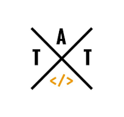

## Bem Vindo👋

<!-- Cabeçalhos -->
_"Testes não quebram sistemas. Eles quebram ilusões sobre sistemas."_

# Olá sejam bem vindos ao meu github
💼 __Atuo na área de tecnologia desde 2009__, com passagens por suporte técnico nos níveis júnior, pleno e sênior.
Desde 2013, venho me dedicando à área de __Quality Assurance__, com foco em garantir a qualidade e a estabilidade de sistemas.
Mais recentemente, comecei a me aprofundar no mundo da automação de testes com Cypress, ampliando minhas habilidades e explorando novas formas de agregar valor aos projetos por meio da automação.

# Onde busco conhecimento
<table style="border-collapse: collapse; border: none;">
  <tr>
    <td align="center" style="border: none; padding: 10px;">
      <a href="https://www.udemy.com" target="_blank" style="text-decoration: none; color: inherit;">
        
        
<strong>Udemy</strong>

      </a>
    </td>
    <td align="center" style="border: none; padding: 10px;">
      <a href="https://www.dio.me" target="_blank" style="text-decoration: none; color: inherit;">
        
        
<strong>Dio.me</strong>

      </a>
    </td>
    <td align="center" style="border: none; padding: 10px;">
      <a href="https://talkingabouttesting.com/" target="_blank" style="text-decoration: none; color: inherit;">
        
        
<strong>Talking About Testing</strong>

      </a>
    </td>
  </tr>
</table>

